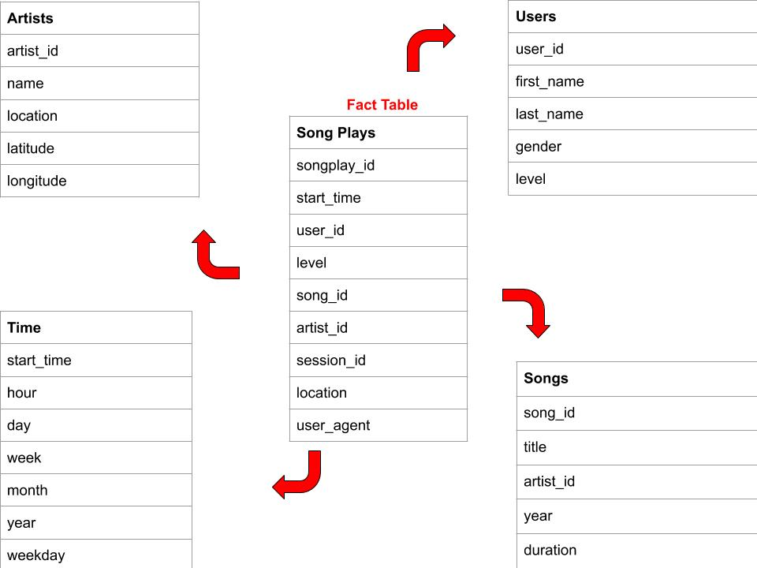
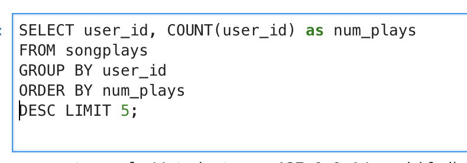
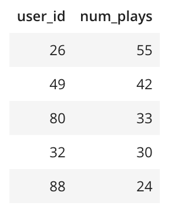

# Sparkify Database: Project One (Modeling with Postgres)

## Objective:

Sparkify is a music streaming app. The goal of this project was to build a relational database schema and an ETL pipeline using two sets of data: song data and log data. Song data is metadata that the streaming app has for artists and songs, while log data is the event log of the user activity from the app.

## Database Schema Design & ETL Pipeline:

The Database follows a star schema model which allows us to be more flexible with our queries by allowing us to perform aggregations and analytics. This format specifically optimizes for queries on song play analysis. The central fact table 'songplays' records log data associated with user song plays. It is connected to 4 dimension tables - 'users', 'songs', 'artists', and 'time'. These 4 tables provide relational data concerning users in the app, songs in the music database, artists in the music database, and timestamps of records in songplays broken down into specific units. 

## File Directory

    * test.ipnyb: This is used to test whether our database operations are working successfully.
    * create_tables.py: Starts a local postgres database called sparkifydb and then creates the tables in the schema.
    * etl.ipnyb: A step by step process of the ETL pipeline. This notebook is used to test and explore the data and build up to fully automating the ETL.
    * etl.py: This script processes the entirety of log and song data.
    * sql_queries.py: Contains all the queries necessary to create, drop, and insert data into our tables.

## To Run

   * Run create_tables.py to create database and associated tables.
   * Run etl.py to execute the pipeline which will read the data files and transfer the data to appropriate tables.

## Sample Query

